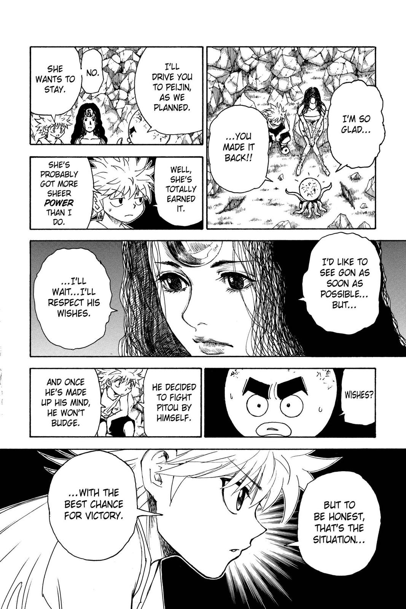
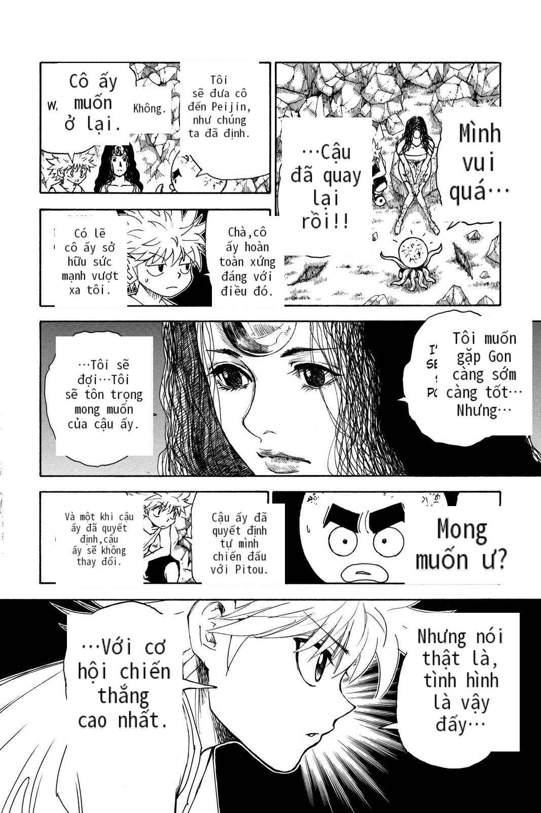

<div align="center">

# 🎌 Manga Translation AI Integration

**An end-to-end AI-powered pipeline that OCRs, translates, and renders manga pages from any language to Vietnamese — directly from your browser.**

[](https://python.org)
[](https://fastapi.tiangolo.com)
[](https://docs.celeryq.dev)
[](https://docker.com)

</div>

---

## 📖 Overview

Manga Translation AI Integration is a full-stack, production-ready pipeline that translates manga to Vietnamese directly from your browser.
The core translation uses a **Vision-Language Model (Gemini)** to perform OCR, localization, and speech-bubble classification in a single multimodal pass — eliminating the traditional OCR → NMT → layout pipeline.
Heavy workloads are offloaded to **Celery async workers**, while a custom **multi-key fallback engine** distributes requests across multiple API keys and model tiers to maximize throughput and minimize wait time.
Cleaned pages are produced by combining **LaMa inpainting** (to erase original text) with a custom typesetter that reflows Vietnamese text into the original bubble geometry.
Across chapters, a **character graph** tracks pronoun relationships and speaking styles, ensuring narrative consistency in the translated dialogue.

The project consists of three major components working together:

| Component | Description |
|-----------|-------------|
| **Chrome Extension** | Captures manga image URLs from any website, supports both scroll-based and paginated readers |
| **Backend (FastAPI + Celery)** | Orchestrates the full translation pipeline asynchronously |
| **Web Reader** | Displays the translated chapter with a clean, manga-optimized reading interface |

### How it works

```
Browser (Chrome Extension)
    │  sends image URLs + chapter metadata
    ▼
FastAPI  ──►  Celery Worker
                │
                ├─ Download images
                ├─ Gemini VLM  (OCR + translate + bubble coords in one pass)
                ├─ LaMa        (inpaint / erase original Japanese text)
                ├─ Renderer    (typeset Vietnamese text back onto page)
                └─ Save to PostgreSQL + disk
                        │
                        ▼
              Web Reader  (http://localhost:8000)
```

---

## 🎬 Demo

| Original Image | Translation Result |
|:---:|:---:|
|  |  |

---

## 🛠️ Tech Stack

### Backend
| Layer | Technology | Purpose |
|-------|-----------|---------|
| **Web Framework** | FastAPI + Uvicorn | Async REST API |
| **Task Queue** | Celery + Redis | Background job processing |
| **Scheduler** | Celery Beat | Periodic cleanup & key-reset tasks |
| **Database** | PostgreSQL + SQLModel | Manga metadata, chapter progress, character graph |
| **Browser Automation** | Playwright (Chromium) | Scraping sites that block direct image downloads |
| **Cache / Broker** | Redis | Celery message broker + result backend |

### AI / ML Pipeline
| Component | Technology | Role |
|-----------|-----------|------|
| **VLM Translation** | Google Gemini 2.0/2.5 Flash | OCR + translate + classify bubbles in one multimodal pass |
| **Fallback Engine** | Custom multi-key scheduler | Rate-limit management across multiple free API keys |
| **Inpainting** | LaMa (Resolution-robust Large Mask) | Erase original Japanese text cleanly |
| **Text Rendering** | Pillow + custom typesetter | Wrap and render Vietnamese text into speech bubbles |
| **Local Models** | Ollama (optional) | Alternative VLM backend (Qwen2.5-VL, LLaMA Vision) |

### Frontend
| Component | Technology | Notes |
|-----------|-----------|-------|
| **Chrome Extension** | Vanilla JS (Manifest V3) | Image capture, pagination detection, SPA-compatible |
| **Playground UI** | HTML + CSS + JS | Test single-page translation, preview results |
| **Web Reader** | HTML + CSS + JS | Full chapter reading with image preloading |
| **iOS Companion** | Scriptable (JS) | Receive notifications, trigger jobs from iPhone |

### Infrastructure
| Tool | Purpose |
|------|---------|
| Docker + Docker Compose | Self-contained 5-service deployment |
| `.env` config | All secrets and runtime settings |

---

## 🚀 Setup Guide

### Prerequisites

- [Docker Desktop](https://www.docker.com/products/docker-desktop/) installed and running
- A [Google Gemini API key](https://aistudio.google.com/) (free tier works)
- Git

### Option A — Docker (recommended, fully self-contained)

```bash
# 1. Clone the repository
git clone https://github.com/lmaosama-811/Manga-Translation-AI-Integration.git
cd Manga-Translation-AI-Integration

# 2. Create your .env from the example template
cp .env.example .env
```

Open `.env` and fill in your values:

```env
GEMINI_API_KEYS=["AIza...your_key_here..."]
```

```bash
# 3. Build and start all services (first run ~15–30 min due to dependencies)
docker-compose up --build

# 4. Open the Playground
#    http://localhost:8000
```

> **Subsequent runs:** `docker-compose up` (uses cached layers, starts in seconds)

### Option B — Manual / Local Development

**Requirements:** Python 3.11+, Redis, PostgreSQL

```bash
# 1. Clone and create virtual environment
git clone https://github.com/lmaosama-811/Manga-Translation-AI-Integration.git
cd Manga-Translation-AI-Integration
python -m venv .venv
.venv\Scripts\activate        # Windows
# source .venv/bin/activate   # Linux / macOS

# 2. Install dependencies
pip install -r requirements.txt
playwright install --with-deps chromium

# 3. Configure environment
cp .env.example .env
# Edit .env with your API keys, DATABASE_URL, REDIS_URL

# 4. Start the app (starts FastAPI + Celery worker + Celery beat)
python run.py            # Windows
# ./run.sh               # Linux / macOS
```

---

### Installing the Chrome Extension

1. Open Chrome → `chrome://extensions/`
2. Enable **Developer mode** (top-right toggle)
3. Click **"Load unpacked"**
4. Select the `FE/extension/` folder
5. The extension icon will appear in your toolbar

**Usage:** Navigate to any online manga reader → click the extension icon → click **"Dịch Chapter"**.

---

### Environment Variables Reference

| Variable | Required | Description |
|----------|----------|-------------|
| `GEMINI_API_KEYS` | ✅ | JSON array of free-tier Gemini API keys |
| `GEMINI_PRO_API_KEYS` | ⬜ | Paid-tier keys for richer translation mode |
| `DATABASE_URL` | ✅ | PostgreSQL connection string |
| `REDIS_URL` | ✅ | Redis connection string |
| `OLLAMA_API_URL` | ⬜ | Ollama endpoint (if using local models) |
| `PLAYWRIGHT_HEADLESS` | ⬜ | `true` in production, `false` for debug |

See `.env.example` for the complete list with defaults.

---

## 📁 Project Structure

```
Manga-Translation-AI-Integration/
├── BE/
│   ├── app/
│   │   ├── ai/                  # VLM integrations (Gemini, Ollama, fallback engine)
│   │   ├── api/routes/          # REST endpoints (translate, scrape)
│   │   ├── celery_tasks/        # Async background jobs
│   │   ├── core/                # Config, logging
│   │   ├── prompts/             # System prompts + genre skill modules
│   │   ├── services/            # DB, inpainting, rendering, AniList, browser scraper
│   │   └── utils/               # Image processing, typesetting, grid overlay
│   ├── fonts/                   # CJK + comic fonts for rendering
│   └── manga_translator/        # Core ML pipeline (LaMa inpainting, text rendering)
│
├── FE/
│   ├── extension/               # Chrome Extension (Manifest V3)
│   ├── static/                  # Playground & Reader web UIs
│   └── scriptable/              # iOS Scriptable companion script
│
├── hf_space/                    # HuggingFace Space for model quality testing
├── Dockerfile                   # Single image for api / worker / beat
├── docker-compose.yml           # 5-service orchestration
└── requirements.txt
```

---

## 🔮 Future Improvements

### 🗣️ Translation Quality
- [ ] **User feedback system** — thumbs up/down per bubble + free-text correction, stored and used to refine prompts over time
- [ ] **Active learning loop** — collect user corrections to periodically fine-tune or prompt-tune the translation model
- [ ] **Multi-language support** — extend beyond Vietnamese to support other target languages

### 🎨 UI / UX
- [ ] **Improved Reader UI** — side-by-side original vs. translated view, zoom controls, keyboard navigation
- [ ] **Better Playground** — drag-and-drop multi-image upload, real-time translation preview, bubble highlighting on hover
- [ ] **Mobile-friendly layout** — responsive design for phone/tablet reading
- [ ] **Progress indicators** — per-page status during chapter translation instead of a single loading spinner

### ⚙️ Backend & Infrastructure
- [ ] **Queue visibility** — dashboard showing job status, estimated time, and per-page progress
- [ ] **Model routing** — automatically select model based on manga art style (e.g., Gemini for detailed, Qwen-VL for stylized)
- [ ] **Batch optimization** — smart page grouping to maximize API throughput within rate limits
- [ ] **Cloud deployment guide** — step-by-step for deploying to a VPS or cloud provider

### 🔌 Integrations
- [ ] **More manga sources** — extend the Chrome Extension with per-site optimized scrapers
- [ ] **AniList sync** — mark chapters as "read" on AniList after completing a translation

---
